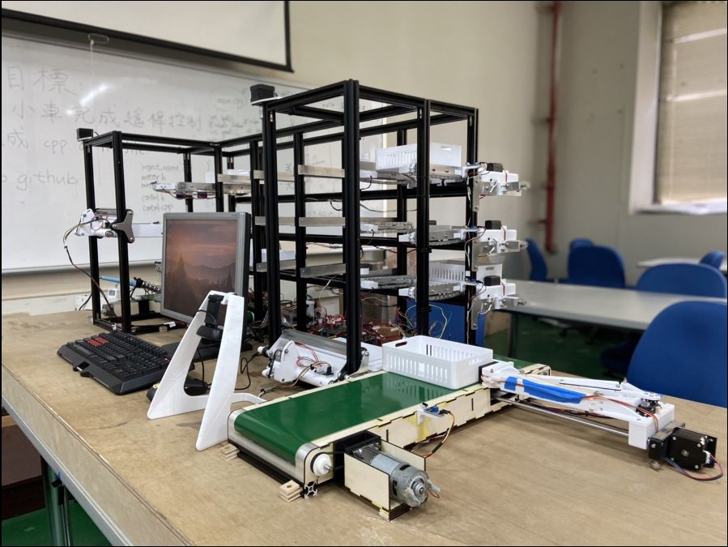

# Pei-Chi Hu

**Robotics software engineer — perception, localization & fleet systems.**
M.S. Computer Vision at Carnegie Mellon University (Dec 2027) · 3.5 years building production robot software at FARobot (Foxconn × ADLINK JV).

**[View the portfolio →](https://peichi-hu.github.io/portfolio/)**  ·  [Resume](https://peichi-hu.github.io/portfolio/Resume_PeiChi.pdf)  ·  [LinkedIn](https://www.linkedin.com/in/peggyhuhu)  ·  [peichih@andrew.cmu.edu](mailto:peichih@andrew.cmu.edu)

Open to **2027 full-time roles** and **2027 summer internships** in robotics, autonomous systems, perception, computer vision and software engineering.

---

## At a glance

| | |
|---|---|
| **Now** | M.S. Computer Vision, Carnegie Mellon University — 3D vision and robot learning |
| **Experience** | R&D Software Engineer → **Senior** Software Engineer, FARobot (Dec 2022 – Jun 2026) |
| **Focus** | Localization · SLAM · 3D perception · Calibration · Multi-vendor fleet architecture · Robot learning |
| **Core stack** | C++ · Python · ROS2 · Nav2 · OpenCV · PCL · PyTorch · Linux · Docker |

| Result | What it measures |
|---|---|
| **44.2%** | lower map-registration error along robot navigation routes |
| **> 50%** | shorter camera calibration cycle time, at sub-millimeter precision |
| **2×** | vertical obstacle coverage in the Nav2 voxel costmap |
| **45.16% → 74.19%** | localization stability during high-speed stops (EKF) |

---

## Selected work

Four production problems, each written up with the system context, my contribution, how the solution evolved, the trade-offs and how it was validated.

**[01 · Unified Architecture for Heterogeneous Robot Fleets](https://peichi-hu.github.io/portfolio/#case-fleet)**
Maps from different robot platforms deformed non-rigidly, so one fleet map couldn't serve them all. After rigid, local-affine and hybrid transforms each hit a limit, the turning point was realizing the benchmark measured the wrong thing: global pixel alignment instead of pose accuracy where robots drive. A route-weighted metric made Thin-Plate Spline registration the clear choice — **44.2% lower error along routes**.

**[02 · 3D Perception for Autonomous Navigation](https://peichi-hu.github.io/portfolio/#case-perception)**
Added depth sensing to a ROS2 / Nav2 stack to catch suspended and low obstacles. Configuration tuning fixed ghost obstacles and the near field, but finer vertical resolution kept shrinking coverage. Reading the voxel-grid source exposed a hard 16-voxel column limit; refactoring it gave **2× vertical capacity**, validated for CPU, memory and battery impact.

**[03 · Automated Camera-to-Robot Extrinsic Calibration](https://peichi-hu.github.io/portfolio/#case-calibration)**
Three AprilTags were mathematically sufficient but not repeatable on a production floor. The fix was the measurement design: a 12-tag fixture, redundant orientation estimates averaged with SVD, and an automatic URDF update behind a REST-triggered workflow — **sub-mm precision, > 50% shorter cycle time**.

**[04 · Simulation-First Validation for Large-Scale SLAM](https://peichi-hu.github.io/portfolio/#case-slam)**
Cartographer drifted in long, feature-sparse corridors on 200 m × 200 m sites, and every physical mapping run took about two hours. Screening configurations in Unity simulation first — then confirming the shortlist on hardware — made re-weighting the pose-graph constraints practical.

## Production engineering

Shorter problems from FARobot, each solved by finding what the system was actually doing — [read them here](https://peichi-hu.github.io/portfolio/#production).

- **Vendor-independent motor QC** — replaced "behaves like the old motor" with control-system metrics (rise time, settling time, 95th-percentile steady-state error).
- **EKF tuning for high-speed stops** — found IMU acceleration unused; re-weighted the filter. 45.16% → 74.19% stability.
- **Localization recovery pipeline** — AprilTag-to-URDF pose re-initializes navigation, triggered from a browser or a PLC.
- **Low-level control for an autonomous pallet jack** — STM32 over CAN bus to motors, BMS and pump controller.
- **Containerized sensor drivers** — Docker for multi-brand LiDAR / IMU; 30% faster deployment.

## Projects

**[Multi-Shuttle Automated Storage and Retrieval System](https://peichi-hu.github.io/portfolio/#project-asrs)** — a three-floor warehouse coordinating 13 moving components (8 conveyors, 2 elevators, 3 shuttles). Queue-based resource ownership removed race conditions; circuit-level debugging raised motor reliability from < 20% to 100%. 1st Place, NYCU ME Project Competition · [Demo](https://youtu.be/lX7ymEV0xXg) · [Paper](https://peichi-hu.github.io/portfolio/PeiChi_ASRS_paper.pdf)

**[AMR Control Stack & Digital Twin](https://peichi-hu.github.io/portfolio/#project-amr)** — ROS navigation to STM32 real-time motor control, with a Gazebo digital twin for validation before hardware.

**Carnegie Mellon coursework** — single-view 3D reconstruction with neural implicit decoders (PyTorch3D); policy gradient, GAE and a DAgger pipeline for continuous control (MuJoCo, Gymnasium).

## Education

- **Carnegie Mellon University** — M.S. Computer Vision, 2026 – 2027
- **National Yang Ming Chiao Tung University** — B.S. Mechanical Engineering, Double Major in Electrical Engineering, 2018 – 2022

---

This repository is the source of the portfolio site (React, Tailwind CSS, Framer Motion), deployed with GitHub Pages. All FARobot diagrams are newly drawn, simplified illustrations and contain no proprietary code, data or internal names.
